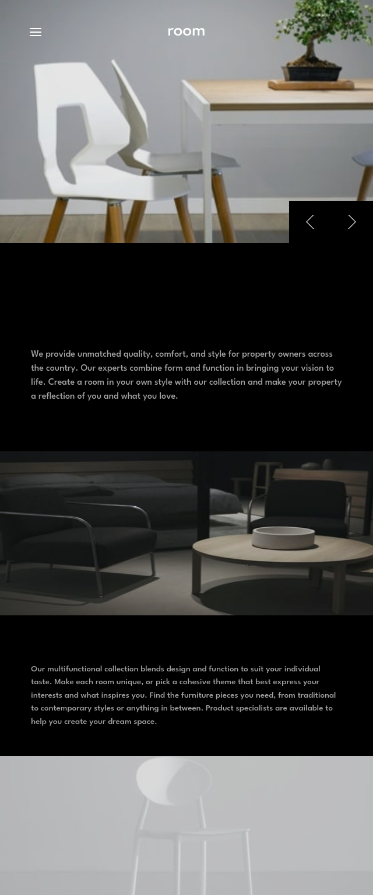

# Frontend Mentor - Room homepage solution

This is a solution to the [Room homepage challenge on Frontend Mentor](https://www.frontendmentor.io/challenges/room-homepage-BtdBY_ENq). Frontend Mentor challenges help you improve your coding skills by building realistic projects. 

## Table of contents

- Accessibility and UX
Use inert to lock focus on the background when the mobile menu is active.

Disable scroll with body-scroll-lock-upgrade.

Smooth transitions with transition: all 0.5s ease-in-out.

### Links

- Solution URL: [Add solution URL here](https://github.com/rf1303/Room-Homepage)
- Live Site URL: [Add live site URL here](https://rf1303.github.io/Room-Homepage/)

## My process

### Built with

- Semantic HTML5 markup
- CSS custom properties
- Flexbox
- CSS Grid
- Mobile-first workflow

### Useful resources

- [Example resource 1](https://www.youtube.com/watch?v=pBv7igaxfQE).

## Author

- Website - [Add your name here](https://www.your-site.com)
- Frontend Mentor - [@yourusername](https://www.frontendmentor.io/profile/yourusername)
